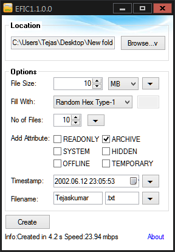

 
 
 
 

# EFIC-EmptyFileCreator
EFIC (Empty File Creator) is a small and reliable application that create file in various size and Pattern. EFIC use two method to create file. First is instant writing and second is Pattern Writing. EFIC is use Windows API and RAM Buffer to create file using various pattern. Pattern range is 0x00 to 0xFF are used to create file.Example: If we use 0x41 pattern for writing the all sector will be filled with 41 41 41 41 etc. when you open this file in notepad you can see equivalent ASCII char AAAA. So it also can be used to secure overwriting file Disc.

**EFIC create empty or blanck file.It uses below methods:**

**Instant File Creating** - EFIC Create instant file like 5, 10, 50 GB in second without writing data or pattern.To create instant blank file open EFIC Choose Location (Default Location is Desktop Dir) now Choose File size to create and choose Do Not Fill(Faster) (Default).And Then Click on Create Button.

**Pattern File Creating** - To create patterned file just select 0x00 or 0xFF Or Custom Char. Custom Char must be in range 0x00 to 0xFF and without 0x Prefix.

**Random Pattern File Writing** - To create Random Pattern File just select Random Hex Type-1 or Random Hex Type-3.

See the [change log](CHANGELOG.md) for changes and road map.

## Performance:

I have Taken Taste on my old Intel P4 3.06Ghz HT with Samsung 7200rpm 80GB HDD.EFIC takes 3804ms for 100mb patterned(0x00) data writing which is about nearly equal to max writing speed of HDD(26mbps).

Another test with my current WD-Green 1 TB SATA-III HHD With Intel 4th Gen i3 processor. EFIC takes 585ms for 100mb patterned(0x00) and 8sec for 1 GB file.

## Binaries
Download the source code or binary only in [EFIC-EmptyFileCreator Releases](https://github.com/gajjartejas/EFIC-EmptyFileCreator/releases/latest)

## Features 
- Capable to create file in Byte to GB in instant speed..(HDD NTFS only)
- Create batch file set attributes and time-stamp.
- Faster method creates any size of file in just seconds.(HDD NTFS only)
- Internal 2MB buffer used to create file so it RAM is low consumed.
- EFIC use pattern writing like 0x00 to 0xFF.
- Also write random data so it can create non-compressible File(s)
- Tested on Windows xp, Windows 7(32bit and 64bit)
- Easy to use Interface.

## Screenshot

## Contribute
For cloning and building this project yourself, make sure
to install the
[AutoIt](https://www.autoitscript.com/site/autoit/) 
and
[AutoIt Script Editor](https://www.autoitscript.com/site/autoit-script-editor/downloads/)
For windows.

To compile this project Right click on  [EFIC.au3](EFIC.au3) and select Compile with Options.
This action opens a new dialog box. Hit compile button to compile, a compiled binary will generate on same folder.

## License
*GNU GENERAL PUBLIC LICENSE version 3* by [Free Software Foundation, Inc.](http://fsf.org/) converted to Markdown.
Read the [original GPL v3](http://www.gnu.org/licenses/).
